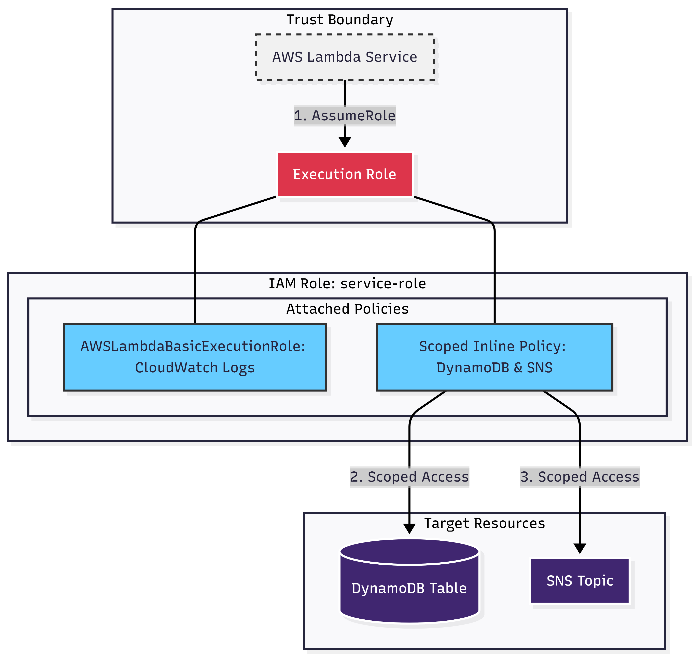

# infrastructure/modules/iam
Goal
- To implement a Least Privilege access model for the GEP platform's compute services.
- Define secure execution identities (Roles) that allow Lambda functions to interact only with the specific resources required for their business logic.

Selected Strategies & Permissions
- Trust Policy: Restricted to lambda.amazonaws.com (or specified service principal) to prevent unauthorized service impersonation.
- Managed Policy: Attaches AWSLambdaBasicExecutionRole to grant standard CloudWatch logging capabilities.
- Inline Scoped Policy: - DynamoDB: Granted PutItem, GetItem, UpdateItem, DeleteItem, Query, and Scan permissions.
- SNS: Granted sns:Publish to support the Compliance Agent's notification workflow.

Rationale
- Resource-Level Scoping: Permissions are strictly bound to the dynamodb_table_arn and sns_topic_arn variables rather than using wildcards (*). This minimizes the "blast radius" in the event of a code-level vulnerability.
- Service-Specific Roles: By using the service_name variable, each microservice (Entity Management vs. Compliance Agent) receives its own distinct IAM Role, ensuring logical separation of duties.
- Inline Policies for Portability: Business-critical permissions are kept as inline policies within the module to ensure they are lifecycle-managed directly with the role they serve.

Security Compliance (Checkov & Best Practices)
- Least Privilege: Does not use overly permissive administrative policies; only specific API actions are allowed.
- IAM Identity-Based Policy: Satisfies security audits by ensuring that the compute service is the only entity capable of assuming the role via sts:AssumeRole.
- Naming Convention: Follows a consistent ${var.service_name}-role pattern for clear resource identification during security reviews and cost allocation.

Notes
- SNS Wildcard Fallback: If sns_topic_arn is not provided, the policy defaults to * for SNS publishing. It is recommended to provide a specific Topic ARN in production to maintain strict scoping.
- Scalability: This module is designed to be reused by any GEP service that requires standard CRUD access to a database and notification capabilities

Architectural Diagram (mermaid)
